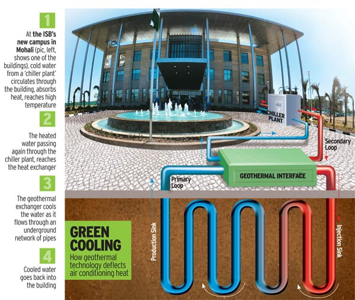
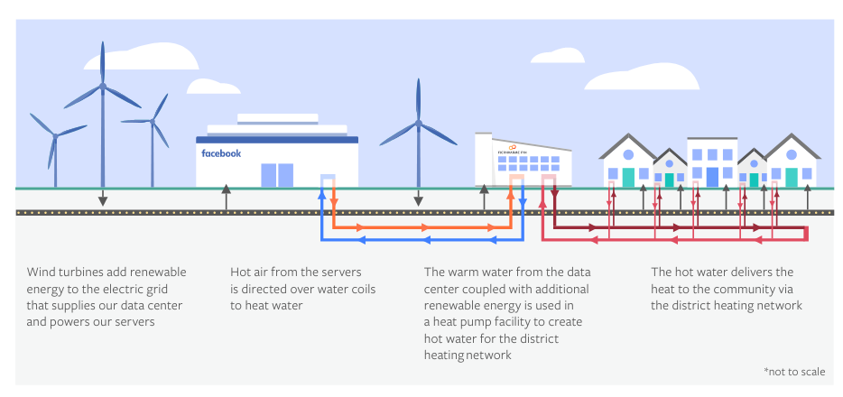

# Datacenter, Rahul Dharmchand sp20-516-223

* :o2: please learn markdown, attending educational section mandatory

The datacenter chapter provided us details about different types of Data Center, their energy usage, CO2 emission and how PUE matters. Making these datacenters efficient and clean is the main goal of providers as well as governments of many countries.

## E.datacenter.2a

As per the sustainability report from Salesforce [@sp20-516-223-sp-dc-2], added the information related to their Phoenix Data Center, Chandler, AZ data center to the [sheet](https://docs.google.com/spreadsheets/d/1gh869zfjA4sVxL8-ga0af2_HLTTuOoD1IReuRSrbq4I/edit#gid=0).

## E.datacenter.2b

Salesforce has about 13 of their own Data Centers in various locations/regions and Chandler, AZ is the largest one (as of Jan 2020).
As per the report, in 2019 this data center consumed about 119 million kWh of energy and caused 57000 metric 
tons of CO2 emission.

## E.Datacenter.3

My personal carbon footprint is about 31,399 lbs while the US average is about 64,946 [sp20-516-223-dc-cf-1].

## E.Datacenter.4

[comment]: # (last-HID-digit modulo 6 => 3%6 = 3, so I choose Thermal.)

The word "Thermal" originated from the greek word Theme means heat. 
Thermal energy is energy produced generally using heat/combustion. 
Traditionally coal is used to heat boilers with water and the steam produced is to used to turn large turbines. 
These rotating turbines through electromagnetism produce electricity. 

Though coal has been a major resource used by thermal plants, it has a huge carbon footprint. 
This led to the usage of renewable resources like natural gas, biomass and other types of combustible 
oils to produce electricity in recent years. 
Countries like Iceland are also finding ways to use geothermal energy to power data centers[sp20-516-223-dc-gt-3]. 

### Geothermal Energy

Geothermal energy is also used to cool data centers which is different from using it to generate electricity. Earth's surface is always constant temperature. 
This feature can be used to dissipate heat generated from the data center and circulate the water through pipes
 filled with special 
coolant from the data center to the underground surface. 
We humans have been using this technique from ages to store food and wine in cellars [sp20-516-223-dc-gt-2].

@fig:sp20-516-223-dc-gt-4 shows how Geothermal energy is used to ISB's new campus in Mohali [sp20-516-223-dc-gt-4].

{#fig:sp20-516-223-dc-gt-4}  

Following data centers use geothermal energy to cool [sp20-516-223-dc-gt-1].
* American College Testing (Iowa)
* Prairie Bunkers, LLC (Nebraska)
* Verne Global (Iceland)

## E.Datacenter.5

### Carbon Footprint

Mega data centers consume a lot of energy. It's estimated that data center consumes about 7% of total energy consumed in USA
and one of the major contributors to CO2 emission which is believed to be the primary cause of global warming. 

### Change in Trend

Federal Energy Regulatory Commission (FERC) has observed that in 2019 renewable energy producers have 
increased their generation capacity and this trend will continue in the coming years [sp20-516-223-dc-ru-1]. 

### Waste Heat Reuse

To reduce carbon footprint, many countries and companies are heavily invested 
in using renewable energy sources as well as innovative ways to reuse energy. 
One such innovation is to reuse the heat generated by IT equipments/servers in data centers aka waste heat. 
As mega/large data centers tend to produce a lot of heat, this heat can be reused to either generate electricity or 
heating nearby homes and offices [sp20-516-223-dc-ru-2]. 

#### Facebook's Odense Data Center

Facebook at its Odense Data Center uses heat produced by servers which after recycling can be used in 
local district heating system [sp20-516-223-dc-ru-3]. As per the report [sp20-516-223-dc-ru-3], Facebook claims 
"Our facility's heat recovery infrastructure will help recover100,000 MWh of energy per year – enough to warm 6,900 homes".

@fig:sp20-516-223-dc-ru-3 shows how waste heat can be reused to heat nearby homes [sp20-516-223-dc-ru-3].

{#fig:sp20-516-223-dc-ru-3}

## E.Datacenter.8

In recent years, all major IT companies (Amazon, Facebook, Google, Salesforce, etc.) had data center outages. 
It not only affects their business, but also all the businesses that depend on their services. 
The average cost of an IT outage is $5600 per minute. 
But that's just the one part. Depending on the type of business, the loss due to downtime could be $14000 per hour 
for low end and as much as $540000 per hour for high-end centers [sp20-516-223-dc-ot-1].

### Costco Outage 

Costco had an outage on Thanksgiving day in 2019 disabling its members from shopping online. 
Costco lost about 11 million in sales just because the website was too slow most of the time and completely out for some time. 
In this case, it was just one companies' loss. But data center host services for many different companies and depending on 
the size an outage can have huge revenue loss for both the providers and the consumer companies.

### Facebook partial Outage - Nov 2019

* Reason for outage: Server configuration change.
* Outage lasted for 14 hours.
* Everyday about 1.4 users use Facebook which is equivalent to a quarter of the world's population. 
A partial outage would impact about half a billion users. 
* Facebook stock was down 1.2% due to this outage as Facebook will loose ad revenue from its pages wiping out billions.
* Many Facebook users conduct business through Facebook and Instagram and downtime means they loose business as well. 
* As the impact was so large, could not find any information related to affected users or loss in revenue. 

### Outage Cost Estimator

An approximate cost of a downtime/outage can be computed using the following [sp20-516-223-dc-ot-2] 

$$ Hourly Labor Cost = P \times A \times C $$

Where: 

* P = number of people affected 
* A = average percentage they are affected 
* C = average employee cost (salaries or wages + benefits)   

